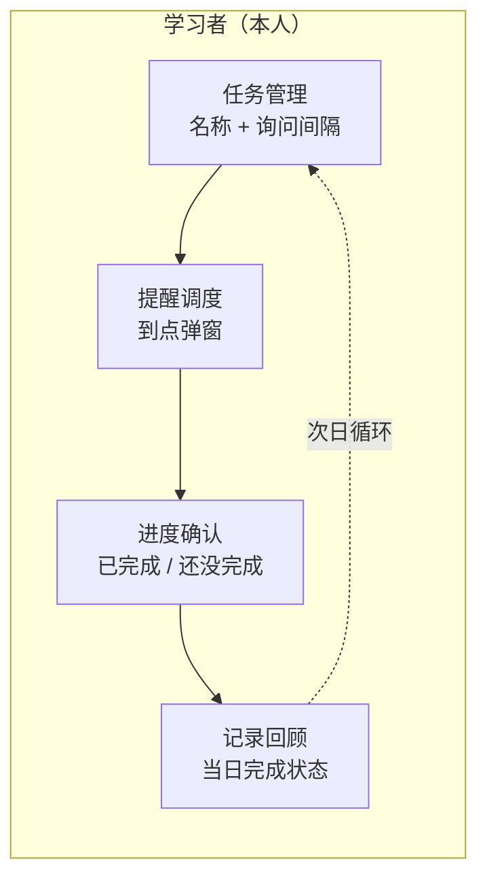
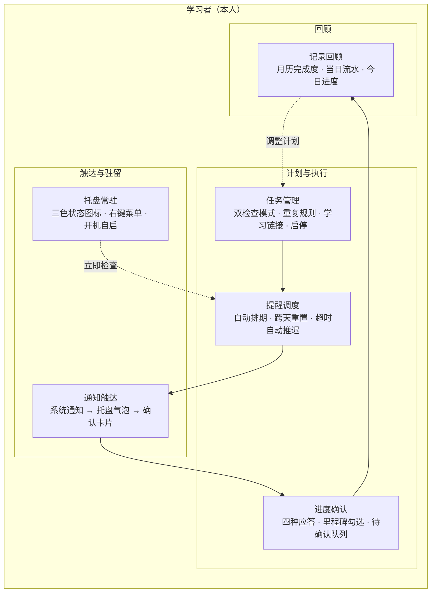
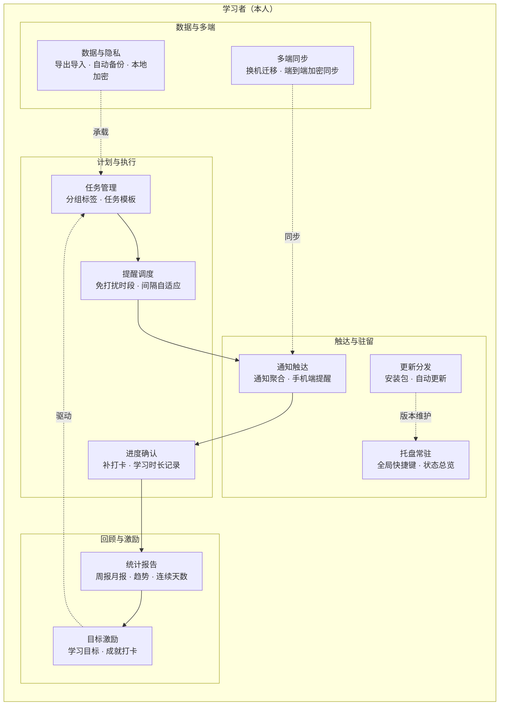

# 学习计划（LearningReminder）迭代功能架构图

> 本文档按 MVP → 核心功能 → 生产级 三阶段推演产品功能演进，并标注当前代码所处阶段。
> 图类型：**功能架构图**（只画用户可感知的功能模块，不出现数据库、消息队列等技术组件）。

---

## 一、当前阶段判定

# 结论：项目当前处于「阶段二：核心功能」，且完成度较高，正站在阶段三的起点。

判定依据：

| 阶段二特征 | 本项目实现情况 |
|---|---|
| 覆盖主要使用场景 | 任务增删改、两种检查模式、四种重复规则、学习链接、今日清单全部具备 |
| 模块化拆分 | 已拆分为调度、确认、通知、托盘、数据、统计等独立服务 |
| 自动化 | 自动排期、到点通知、超时自动推迟、跨天自动重置、开机自启 |
| 状态机成型 | 未排期 → 已排期 → 待确认 → 已完成 / 已推迟（`TaskProgress`） |
| 基础容错 | 通知失败降级气泡、数据损坏自动备份、全局异常兜底、单实例互斥 |
| 通知/消息模块 | Windows Toast（带操作按钮）+ 托盘气泡 + 确认卡片三级触达 |
| 数据统计 | 今日完成进度、月历完成度着色、当日检查流水 |

尚未进入阶段三的缺口：**数据导出/加密、多端同步、周月报与连续天数统计、免打扰时段、自动更新**均未提供。

---

## 二、角色识别（强制前置）

回答三个必答问题：

1. **使用者是谁？** —— 只有一个角色：**学习者本人**。产品是单机常驻桌面小工具，所有功能围绕"督促自己完成当天学习"展开。
2. **是否存在隐私边界？** —— 学习任务与完成记录属个人隐私数据，数据仅存本机 JSON 文件，无服务端、无任何第二方访问，天然不存在"查看他人数据"的角色。
3. **每个角色是否必然？** —— 是。不存在管理者、运营方、教师等角色，严禁因"别的系统都有后台"而硬加管理端。

产品形态：**单角色 · 个人工具 · 隐私敏感型**。

**粒度定标**：一个框 = 一个有独立入口、独立数据、可一句话描述的功能模块（如"任务管理"是一个框，"选周几"只是其内部丰富度）。同一模块在三阶段粒度不变，只变有无与丰富度。

---

## 三、阶段一：MVP（最小可行性产品）

- **核心假设**：到点反复询问"学了吗"，能逼自己完成当天的学习任务。
- **最小闭环**：建任务 → 到点弹窗 → 应答确认 → 当天标记完成，次日循环。
- **可人工顶上的环节**：保持窗口开着即可提醒；历史只看当天；任务默认每天执行，无需重复规则。

**刻意不做（MVP 阶段）：**

- ⏸️ 托盘常驻与开机自启 —— 验证假设阶段保持窗口运行即可
- ⏸️ 重复规则 —— 默认每天，不增加配置成本
- ⏸️ 里程碑模式、学习链接 —— 只验证"定时询问"这一个核心动作
- ⏸️ 系统通知三级触达 —— 一个模态弹窗足够
- ⏸️ 月历与历史统计 —— 状态可人工查当天即可

---

## 四、阶段二：核心功能（当前所处阶段）

把 MVP 揉在一起的"定时弹窗"拆为**调度**与**触达**两条职责；补齐重复规则、第二种检查模式、常驻能力与历史回顾，从"能跑"走向"每天都愿意开着用"。

### 增量标注（相比 MVP）

- ➕ **通知触达**（新增）：系统通知带"已完成 / 还没完成 / 稍后再说 / 立即学习"按钮，不可用时降级托盘气泡，无人应答再弹右下角确认卡片兜底
- ➕ **托盘常驻**（新增）：关闭窗口仅隐藏；图标三态（正常 / 待确认橙色 / 今日全完成绿色）；右键菜单支持打开、立即检查、开机自启、退出
- 🔄 **任务管理**（增强）：定时询问 / 里程碑双模式；每天 / 每周 / 每月（短月顺延）/ 自定义（含工作日一键勾选）；学习链接；启用停用
- 🔄 **提醒调度**（增强）：当天首次自动排期、跨天自动重置、非执行日不打扰、超时未应答自动推迟
- 🔄 **进度确认**（增强）：已完成 / 还没完成 / 稍后再说 / 里程碑部分完成四种应答；同一任务待确认去重
- 🔄 **记录回顾**（增强）：左侧 6×7 月历按完成度着色 + 右侧当天检查流水；今日完成数 / 总数 / 百分比

### 当前代码落点（已实现证据）

| 功能模块 | 主要实现 |
|---|---|
| 任务管理 | `Models/LearningTask.cs`、`RepeatRule.cs`、`CheckMode.cs`、`MilestoneItem.cs`；`Views/TaskEditWindow.xaml` |
| 提醒调度 | `Services/SchedulerService.cs`、`SchedulePlanner.cs`；`DataStore.EnsureToday()` 跨天重置 |
| 进度确认 | `Services/CheckInService.cs`、`PendingCheckIn.cs`；`Views/CheckInWindow.xaml` |
| 通知触达 | `Services/NotificationService.cs`、`ToastArguments.cs`、`LinkLauncher.cs` |
| 托盘常驻 | `Services/NotifyIconHost.cs`、`TrayIconFactory.cs`、`AutoStartService.cs`、`SingleInstanceService.cs` |
| 记录回顾 | `Models/DailyRecord.cs`、`CheckInLogEntry.cs`；`Services/DailyStats.cs`；`CalendarDayViewModel.cs`、`RecordRowViewModel.cs` |
| 数据与容错底座 | `Services/DataStore.cs`（原子写入 + 损坏备份 + 历史裁剪）、`FileLogger.cs`（全局异常落盘） |

**刻意延后到阶段三：**

- ⏸️ 数据导出 / 导入 / 本地加密 —— 单机验证期暂不需要迁移
- ⏸️ 多端 / 云同步 —— 无服务端，先证明桌面端价值
- ⏸️ 周报月报、连续天数趋势 —— 先积累足够天数的数据
- ⏸️ 自动更新、免打扰时段 —— 分发规模与长时运行场景成熟后再做

---

## 五、阶段三：生产级（演进目标）

个人工具型产品的生产级重点是：**数据安全可携带、长期坚持有反馈、提醒策略不打扰、多设备不掉线**。每个新增模块都对应一个真实的长期使用问题。

### 增量标注（相比核心功能）

- ➕ **目标激励**：解决"坚持三个月后没有正反馈"的问题 —— 学习目标、连续打卡、成就体系
- ➕ **数据与隐私**：解决"换机 / 文件损坏导致记录丢失"的问题 —— 一键导出导入、定时自动备份、敏感数据本地加密
- ➕ **多端同步**：解决"人不在电脑前收不到提醒"的问题 —— 手机查看与应答、端到端加密同步、换机迁移
- ➕ **更新分发**：解决"常驻工具版本迭代后用户无感"的问题 —— 标准安装包、后台自动更新
- 🔄 **统计报告**：由月历流水升级为周报 / 月报、完成趋势、连续天数（streak）
- 🔄 **提醒调度**：新增免打扰时段（睡眠 / 会议）、依据历史应答情况自适应询问间隔
- 🔄 **进度确认 / 通知触达**：补打卡、学习时长；通知聚合避免轰炸，关键提醒可走手机端
- 🔄 **任务管理 / 托盘常驻**：任务分组与模板；全局快捷键、更丰富的悬停总览

**刻意不做（与个人工具形态无关，防止堆砌）：**

- ⏸️ 计费、会员、营销、优惠券 —— 非商业化产品
- ⏸️ 社区、评价、客服工单 —— 无社交关系链
- ⏸️ 微服务、限流熔断、多租户 —— 单机应用无此类生产问题

**可扩展点**：若未来引入移动端，`多端同步` 将成为中枢模块，`通知触达` 与 `进度确认` 可复用到手机端；`统计报告` 的数据沉淀也可为后续"AI 学习建议"留出接口。

---

## 六、三阶段功能对照表

| 功能模块 | MVP | 核心功能（当前） | 生产级 |
|---|---|---|---|
| 任务管理 | 名称 + 间隔 | 双模式 / 重复规则 / 链接 / 启停 | 🔄 分组标签 / 模板 |
| 提醒调度 | 到点弹窗（与触达合一） | 自动排期 / 跨天 / 超时推迟 | 🔄 免打扰 / 自适应 |
| 进度确认 | 完成 / 未完成 | 四应答 / 里程碑 / 待确认队列 | 🔄 补打卡 / 时长 |
| 通知触达 | —（职责含在弹窗内） | Toast / 气泡 / 卡片三级 | 🔄 聚合 / 手机端 |
| 托盘常驻 | — | 三色图标 / 菜单 / 自启 / 单实例 | 🔄 快捷键 / 总览 |
| 记录回顾 | 当日状态 | 月历 / 流水 / 今日进度 | 🔄 周月报 / 趋势 / 连续天数 |
| 目标激励 | — | — | ➕ 目标 / 成就 |
| 数据与隐私 | — | 原子写入 + 损坏自动备份（底座） | ➕ 导出导入 / 加密 |
| 多端同步 | — | — | ➕ 手机端 / 加密同步 |
| 更新分发 | — | 官网下载页（手动） | ➕ 安装包 / 自动更新 |
| 模块总数 | 4 | 6 | 10 |

---

## 七、给当前项目的下一步建议（优先级排序）

1. **数据导出 / 导入**：成本最低、价值最直接，先解决数据可携带与备份焦虑（对应 P9 的最小切片）。
2. **免打扰时段 + 周视图统计**：纯本地计算，不引入服务端即可显著提升长期使用体验（P2、P7 的最小切片）。
3. **连续打卡 / 成就**：用已有的 `DailyRecord` 数据即可计算，为坚持提供正反馈（P8）。
4. **自动更新**：当用户规模扩大后再做（P6）。
5. **多端同步**：成本最高且需引入服务端，放在最后，并用端到端加密守住隐私边界（P10）。
